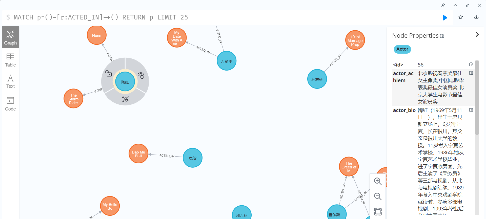

# movie_kg
构建一个电影的知识图谱实例



# 0.依赖
```commandline
mysql 8.0
navicat 11
jdk 1.8
neo4j 3.5
```

# 1.数据处理
[注意：也可以直接使用我处理过的数据，跳过此步]

数据来源：[地址](https://github.com/KWang916/kg_movie)

但是数据有些问题，我这里做了修改，所以以当前目录下的数据为准

## 0.1.加载sql语句，进行数据插入
1.安装navicat,mysql

2.使用mysql 开启一个空的数据库，然后使用navicat链接，打开navicat的查询窗口，将当前目录下的`kg_movie.sql`加载进来

这里具体过程可以参考：[知识图谱构建——Mysql 和 neo4j 数据导入（一）](https://blog.csdn.net/Bulldozer_GD/article/details/89490285)

## 0.2.转化数据为`xxx.csv`
将当前表中的数据导出为`actor.csv`、`genre.csv`、`movie.csv`、`actor_to_movie.csv`、`movie_to_genre.csv`四个文件，方便接下来neo4j加载。

你可以在`数据.xlsx`中方便地查看数据情况，这里最关键的是如何从`actor`和`movie`中梳理构造出`actor_to_movie`和`movie_to_genre`连个关系，同时这两个关系分别都是多对多的关系
# 2.neo4j构造图数据
服务器/本地 安装jdk1.8 以及neo4j 3.5。

打开neo4j，然后在浏览器进行数据插入：

```commandline
# 1.导入节点：actor、genre、movie 三个数据
load csv with headers  from "file:///genre.csv" as line create(a:genre{genre_id:line.genre_id,genre_name:line.genre_name})

:auto USING PERIODIC COMMIT 100
LOAD CSV FROM 'file:///actor.csv' AS line CREATE (a:Actor { actor_id: line[0], actor_bio: line[1], actor_chName: line[2], actor_foreName: line[3],actor_nationality: line[4], actor_constellation: line[5], actor_birthPlace:  line[6], actor_birthDay: line[7], actor_repWorks: line[8], actor_achiem: line[9], actor_brokerage: line[10] })

:auto USING PERIODIC COMMIT 100
LOAD CSV FROM 'file:///movie.csv' AS line CREATE (m:Movie { movie_id: line[0], movie_bio: line[1], movie_chName: line[2], movie_foreName: line[3], movie_prodTime: line[4], movie_prodCompany: line[5], movie_director:  line[6], movie_screenwriter: line[7], movie_genre: line[8], movie_star: line[9], movie_length: line[10], movie_rekeaseTime: line[11], movie_language: line[12], movie_achiem: line[13] })


# 2.导入关系：actor_to_movie、movie_to_genre
LOAD CSV FROM 'file:///actor_to_movie.csv' AS line MATCH (a:Actor), (m:Movie) WHERE a.actor_id = line[1] AND m.movie_id = line[2] CREATE (a) - [r:ACTED_IN] -> (m) RETURN r;

LOAD CSV FROM 'file:///movie_to_genre.csv' AS line MATCH (m:Movie), (g:genre) WHERE m.movie_id = line[1] AND g.genre_id = line[2] CREATE (m) - [r:Belong_to] -> (g) RETURN r;

# 3.查询
match p=()-[r:Belong_to]->(n:genre) where n.genre_name="动作" return p

```